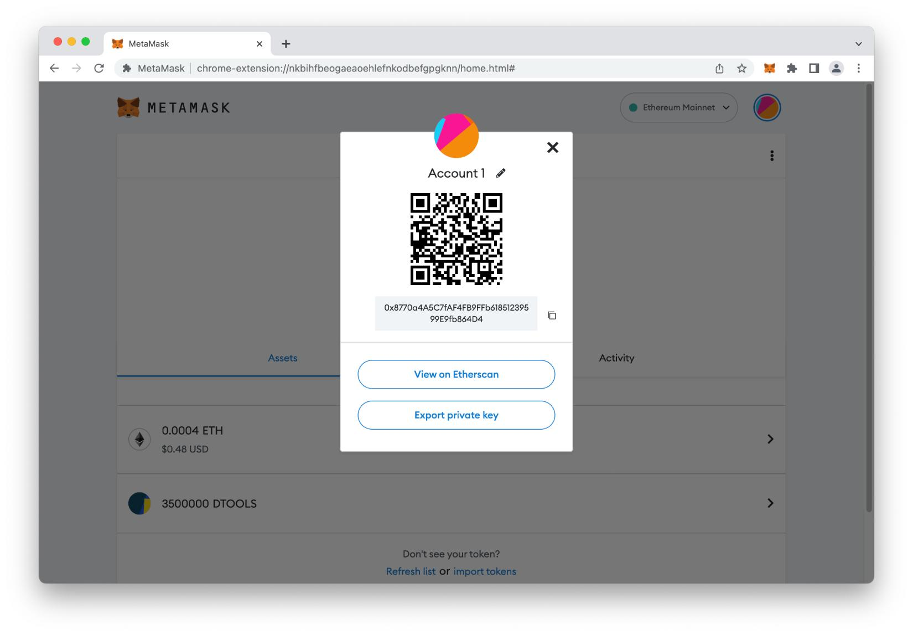
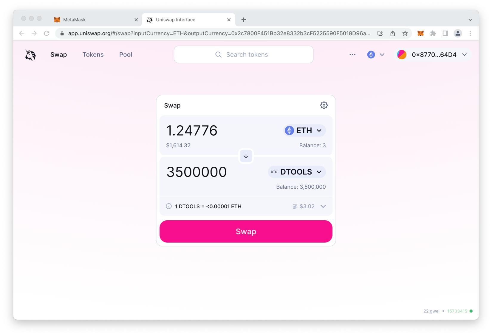
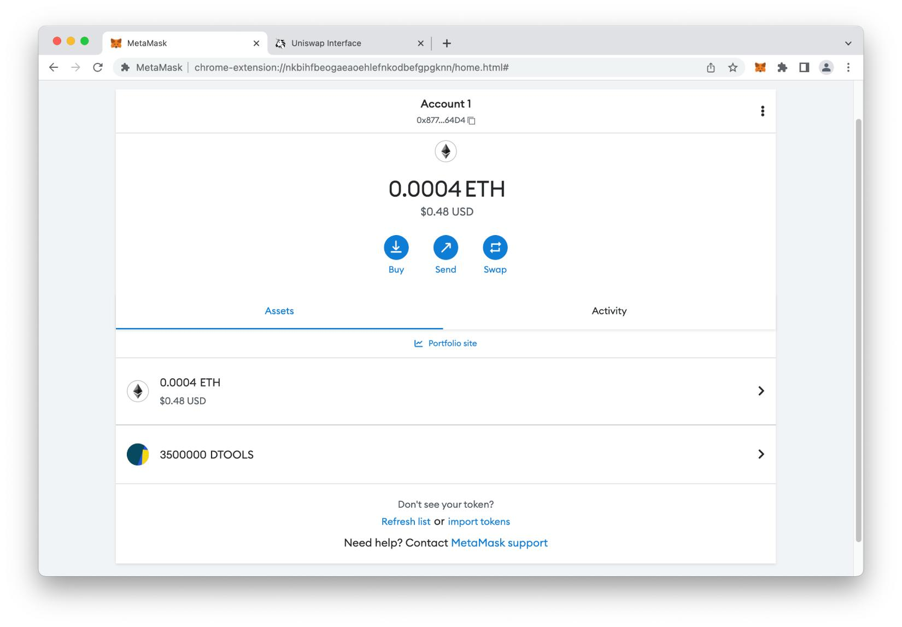
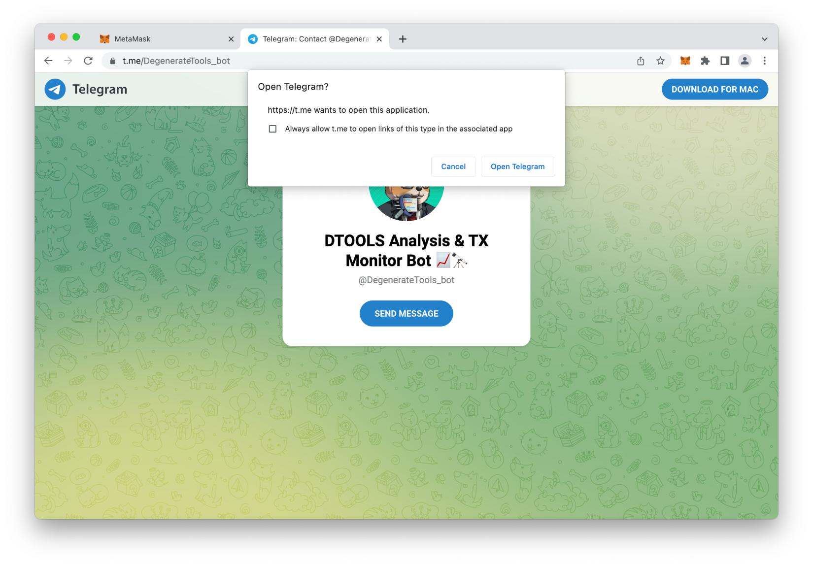
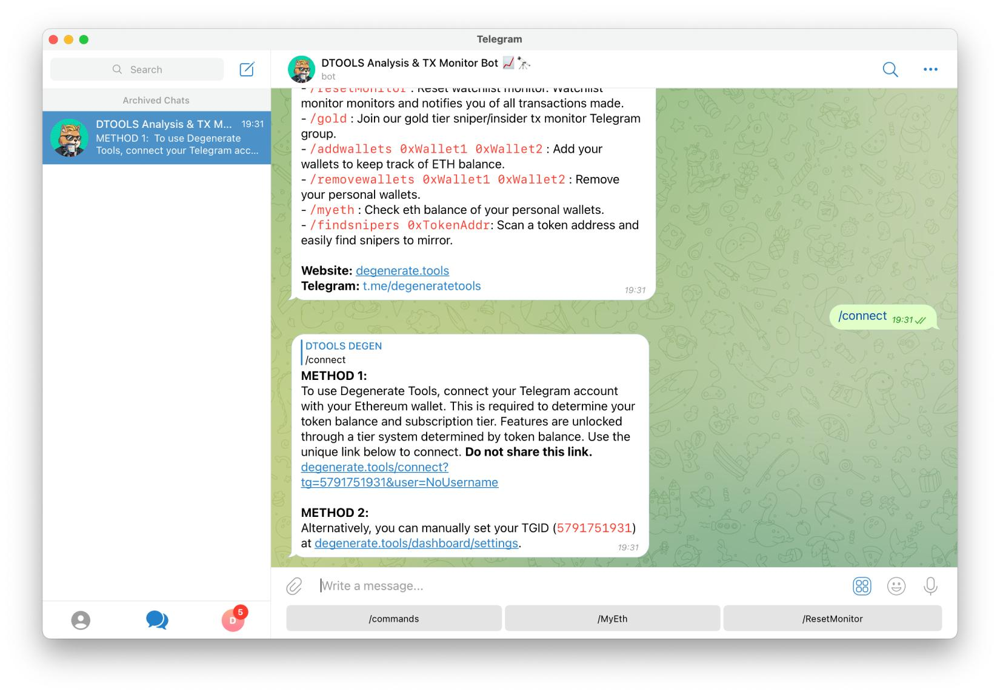
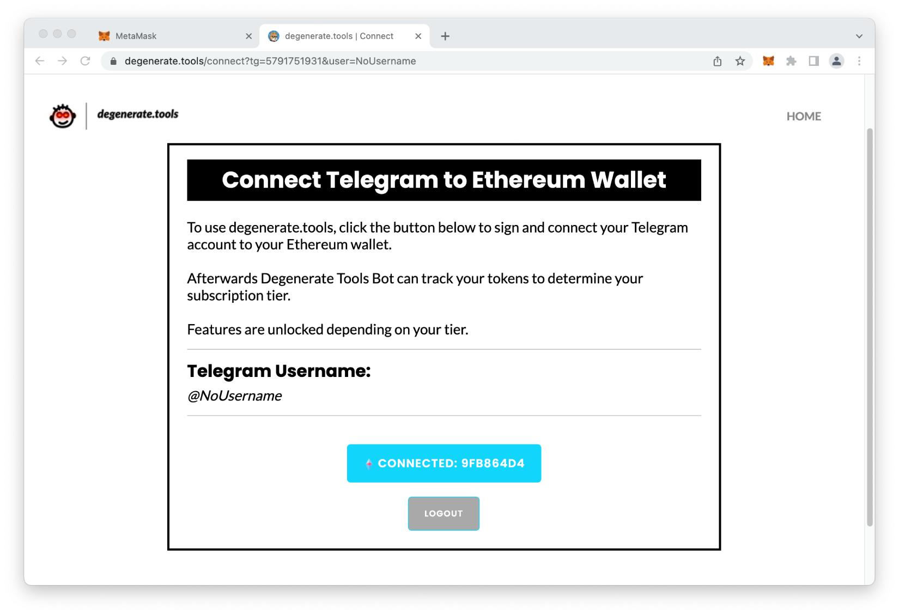
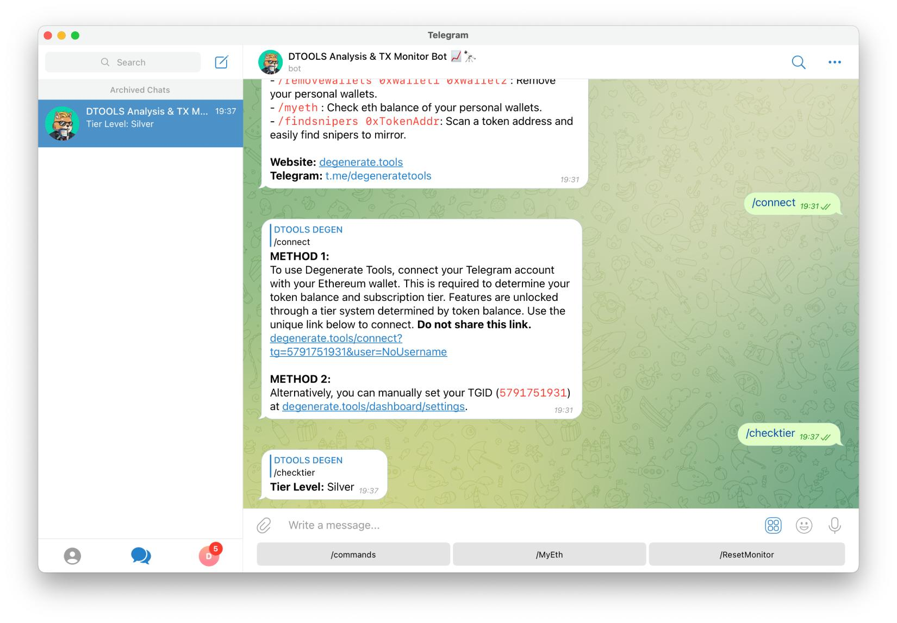

# How to setup DTOOLS
## Step 1 - Install MetaMask

Before buying $DTOOLS and using the utilities it offers, first it's required to download and setup [MetaMask](https://metamask.io/ "Metamask"). 

> **Skip to step two if you already have your own MetaMask wallet.**

MetaMask is required for for two main reasons:
1. To swap $ETH (Ether) for $DTOOLS, which is an ERC-20 native token on the Ethereum blockchain.
2. To verify $DTOOLS token amount and connect to DTOOLS telegram bots and dapp.

To download the MetaMask wallet visit [Chrome Web Store](https://chrome.google.com/webstore/detail/metamask/nkbihfbeogaeaoehlefnkodbefgpgknn "Chrome Web Store).

Once installed, you can import your pre-existing wallet using your private key, or proceed to create a new wallet with a new seed phrase. 

## Step 2 - Buy $DTOOLS
In this step we will swap $ETH for $DTOOLS.

Before making the swap, you will need to deposit Ether to your wallet. This can be done within MetaMask by selecting 'Buy', or as is most commonly done, receiving Ether from another wallet or a centralized exchange. 

To deposit and receive Ether your wallet address is required; it can be found in your MetaMask wallet under **account name**.



Once you have enough Ether to make a swap, visit [degenerate.tools](http://degenerate.tools/) and under the tokenomics section, follow the link to ['Buy DTOOLS'](https://app.uniswap.org/#/swap?inputCurrency=ETH&outputCurrency=0x2c7800F451Bb32e8332b3cF5225590F5018D96a5&chain=mainnet "Uniswap") via Uniswap. 

Confirm the token address you are importing on Uniswap is the same as below and select '**Import**'.
```
0x2c7800F451Bb32e8332b3cF5225590F5018D96a5
```

Proceed to swap enough Ether to give you 1.5, 3.5 or 7.5 million $DTOOLS, depending on your chosen tier. Make sure to set your slippage to 0.5% in the settings to avoid Mev bots.



To confirm the transaction was successful, view your recent transactions under the '**Activity**' tab in MetaMask.

## Step 3 - Import $ DTOOLS
Before connecting our wallet to DTOOLS utilities, we will need to import $DTOOLS into MetaMask.

Open MetaMask and select 'import token' at the bottom of the tokens list.
	
Select the '**Custom token**' tab.

Paste the $DTOOLS token address under the field labelled '**Token contract address**'

Select '**Add custom token**'.

You should now be able to see your token balance of $DTOOLS under the '**Assets**' tab.



Make sure you have the full amount of $DTOOLS tokens needed for the tier you are going for:

Bronze | Silver | Gold
--- | --- | ---
1,500,000 | 3,500,000 | 7,500,000

> ***If you connect to the DTOOLS without enough DTOOLS, you may run into errors later on.***

## Step 4 - Connect wallet
In this step we will connect our Ethereum wallet to DTOOLS Analysis & TX Monitor Bot.

**It is recommended only to do this once you have enough DTOOLS.**

First thing is to connect to the main telegram bot which gives you most functions to call like Gains Analysis, Snipe Analysis and Sniper Sniffer.

Follow the to DTOOLS [Analysis & TX Monitor Bot](https://t.me/DegenerateTools_bot) and select '**Open Telegram**':



Select '`/start`' to begin interacting with the bot within the telegram chat user interface.

Shortly after, information about DTOOLS and a list of commands will be made available to you. Before going into all the commands, let's set it up right.

Call the connect function by typing '`/connect`'

Under '**METHOD** 1' select the link to connect your Telegram account to the bot.



Select '**CONNECT & SIGN**'

Connect with your chosen MetaMask selected account. Select '**Next**'.

Select '**Connect**' to confirm the connection to your MetaMask account.

> It will show a connecting status.

Then finally, select '**Sign**' for the signature request that truly confirms your DTOOLS holdings with the bot. 

Upon completion the webpage should show a '**CONNECTED: 9FB86D4**' button which indicates your Telegram ID (separate to your @username) is successfully connected.

 

To confirm your connection check your tier level by going back into the Telegram bot and typing `'/checktier'`.

If successfully connected, it should show your tier level as below.

